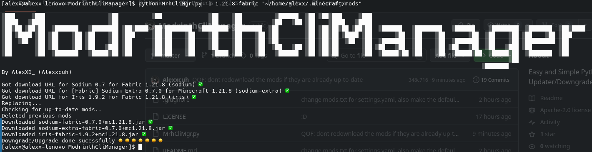
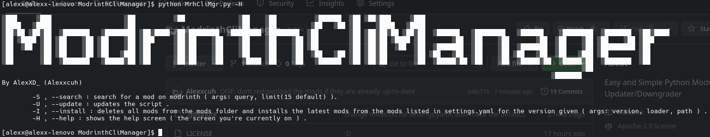
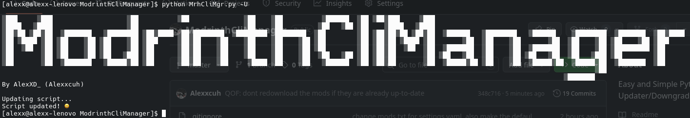
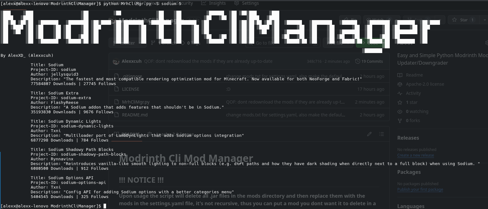

# Modrinth Cli Manager
[](https://github.com/Alexxcuh/ModrinthCliManager/stargazers)


**Modrinth Cli Manager** is a simple and easy to use manager that lets you quickly update all of your mods, and also lets you search for other mods.

## !!! NOTICE !!!
**Upon usage the script will delete all .jar files in the mods directory and then replace them with the mods in the settings.yaml file, it's not recursive, thus you can put a mod you dont want it to delete in a subfolder in the mods folder. this can be changed in the settings**
Also, don't confuse the mod name with the project id, they are 2 separate things, for example, ``https://modrinth.com/mod/gamma-utils``, the mod name is ``Gamma Utils (Fullbright)``, and the project id is ``gamma-utils``, don't confuse one another or the script won't work correctly.  
## Usage
you put into the mods.txt file the project ids of the modrinth mods, you can find them in the link of the site, eg: ``https://modrinth.com/mod/lithium/``, the project id would be ``lithium``

**the mods.txt file must be in the same directory as the script or it wont work.**
## -I , --install

``version``: the default minecraft version the script will go to is the latest minecraft version there is. (optional)

``loader``: the default loader choosen by the script is fabric. (optional)

``mod directory``: the default mod directory it chooses is the default mod dir of your operating system, if you're not using **Linux**, **Windows** or **MacOS** you'll have to input the mod directory manually. (optional)

**Note**: the default paramaters for --install can be changed in settings.yaml
### Example settings.yaml
```yaml
loader: fabric
mods:
- sodium
- sodium-extra
- iris
path: /home/user/.minecraft/mods
version: 1.21.8
```
## -H , --help

shows the help screen where you can see this in a short form.
## -U , --update

updates the script to the latest version of the script there is.
## -S , --search

``query``: the mod you want to search on modrinth, this is a required paramater.

``limit``: how many mods it can show at once, the default chosen is 15. (optional)

## Keep in Mind
If there's a feature that's missing and you consider important or someting about the script bothers you, feel free to change it and contribute to the project :D

## SETTINGS

# scan_dependencies - boolean: true
all this does is if left on will continue checking for dependencies everytime when installing mods, very useful when you don't check the dependencies for mods but can be annoying when you are just updating your mods, thus the setting. - normally left true.
# delete_old_mods - boolean: true
enables or disables the functionality of the script deleting every .jar file from the mods folder when installing mods, really useful if you have some mods in there that you dont want to reinstall or that modrinth doesn't have and you'd want to use this for modrinth and something else for curseforge. - normally left true.
# title_enabled - boolean: true
enables or disables the annoying splash text of the script, the ModrinthCliManager splash text, to be more exact, the big title can be very annoying at times, thus the setting. - normally left true.

# More settings coming soon